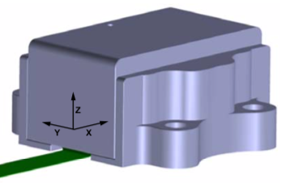
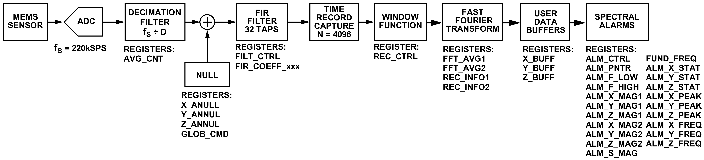
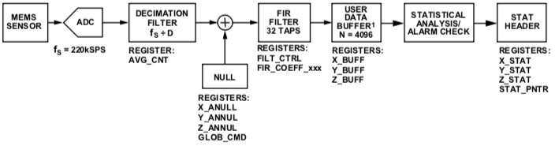

# VibrationDAQ
Data Acquisition (DAQ) of the Analog Devices ADcmXL3021 vibration sensor

TODO picture of VibrationDAQ

## Hardware
- Raspberry Pi is powered over the PPK port of the MCU.
- Analog Devices ADcmXL3021 vibration sensor capabilities
    - [Corrected data sheet](docs/ADcmXL3021_corrected.pdf)
    - Sensor orientation:\
    
    - Mass: 13 g
    - ±50 g measurement range
    - MFFT mode: Spectral analysis through internal FFT\
    
        - 2048 bins per axis with user configurable bin sizes from 0.42 Hz to 53.7 Hz
        - Windowing options: rectangular, Hanning, flat top
    - MTC mode: Time domain capture\
    
        - 4096 samples per axis
- [Features a status LED](#status-led)

### Pinout Raspberry Pi
TODO

## Installation
1. Install yaml-cpp (as described below)
2. Clone this repo.
3. `cd VibrationDAQ`
4. `mkdir build & cd build`
5. `cmake ..`
6. `sudo make install`

You can use it now with `vibration_daq_app [full path to config.yaml]`.

### Enable/Disable Autostart
1. Edit config.yaml path in vibration_daq.service file to own needs 
2. `sudo systemctl enable [full path to vibration_daq.service file]`    
    This automatically links the service and enables it. Replace `enable` with `disable` to disable service.

## Dependencies
### yaml-cpp (Installation)
https://github.com/jbeder/yaml-cpp
1. `wget https://github.com/jbeder/yaml-cpp/archive/yaml-cpp-0.6.3.tar.gz`
2. `tar -xvf yaml-cpp-0.6.3.tar.gz`
3. `cd yaml-cpp-yaml-cpp-0.6.3/`
4. `mkdir build`
5. `cd build`
6. `cmake .. -DYAML_BUILD_SHARED_LIBS=ON`
7. `sudo make install`

## Usage
### Status led
If the status led is enabled in config, it will glow when running:
- Constant glow: data acquisition is running normally
- Blink: measurement completed, saving data to a new csv file

## Config file
Short primer on the syntax of yaml: https://learnxinyminutes.com/docs/yaml/

### Decimation Filter
Setting the right `decimation_factor` is crucial for getting meaningful data. Choose it according to the maximum vibration frequency you're expecting.
Of course, the decimation factor also affects the predefined FIR filters i.e. with a FACTOR_64, the LOW_PASS_10kHz is actually a 156 Hz low pass filter.  
 
| **decimation_factor** | **Effective Sample Rate, fS (SPS)** | **Effective FFT Bin Size, f_MIN (Hz)** | **Effective Maximum FFT Frequency, f_MAX (Hz)** |
|-------------------|---------------------------------|------------------------------------|---------------------------------------------|
| FACTOR_1          | 220000                          | 53.71094                           | 110000                                      |
| FACTOR_2          | 110000                          | 26.85547                           | 55000                                       |
| FACTOR_4          | 55000                           | 13.42773                           | 27500                                       |
| FACTOR_8          | 27500                           | 6.713867                           | 13750                                       |
| FACTOR_16         | 13750                           | 3.356934                           | 6875                                        |
| FACTOR_32         | 6875                            | 1.678467                           | 3437.5                                      |
| FACTOR_64         | 3437.5                          | 0.839233                           | 1718.75                                     |
| FACTOR_128        | 1718.75                         | 0.419617                           | 859.375                                     |

### Spectral average count
The `spectral_avg_count` determines determine the number of FFT records that the ADcmXL3021 averages when generating the final FFT result. Up to 255 records. Good for getting FFT measurements over longer time periods.

### Example config with explanation
```yaml
storage_directory: "/home/pi/Documents/"
recordings_count: 2 #number of recurring measurements, infinite if == 0 
external_trigger: false # false: triggering over SPI; 
                        # true: triggering over dedicated pin, useful for triggering multiple sensor at exact same time (connect them to same pin)
external_trigger_pin: 4 # only read if external_trigger == true
status_led: true # enable/disable status led, blinks everytime a vibration file is written
status_led_pin: 21  # only read if status_led == true
sensors:
  - name: sensor1 #will be used for logging and filenames
    busy_pin: 22 #BCM pin number
    reset_pin: 27 #BCM pin number
    spi_path: "/dev/spidev0.0"
    recording_mode: MFFT # MTC and MFFT supported
    MFFT_config: &mfftConfig #only read if recording_mode == MFFT
      decimation_factor: FACTOR_2 #supported: [FACTOR_1 = 0, FACTOR_2 = 1, FACTOR_4 = 2, FACTOR_8 = 3, FACTOR_16 = 4, FACTOR_32 = 5, FACTOR_64 = 6, FACTOR_128 = 7]
      fir_filter: CUSTOM #supported: [NO_FILTER, LOW_PASS_1kHz, LOW_PASS_5kHz, LOW_PASS_10kHz, HIGH_PASS_1kHz, HIGH_PASS_5kHz, HIGH_PASS_10kHz, CUSTOM]
      custom_filter_taps: [6, 21, 53, 107, 193, 316, 480, 686, 930, 1203, 1490, 1774, 2034, 2251, 2407, 2489, 2489, 2407, 2251, 2034, 1774, 1490, 1203, 930, 686, 480, 316, 193, 107, 53, 21, 6]
      spectral_avg_count: 2 # value between 1-255
      window_setting: HANNING #supported: [RECTANGULAR, HANNING, FLAT_TOP]
    MTC_config: #only read if recording_mode == MTC
        decimation_factor: FACTOR_2
        fir_filter: CUSTOM
        custom_filter_taps: [6, 21, 53, 107, 193, 316, 480, 686, 930, 1203, 1490, 1774, 2034, 2251, 2407, 2489, 2489, 2407, 2251, 2034, 1774, 1490, 1203, 930, 686, 480, 316, 193, 107, 53, 21, 6]
  - name: sensor2
    busy_pin: 24
    reset_pin: 23
    spi_path: "/dev/spidev0.1"
    recording_mode: MFFT
    MFFT_config: *mfftConfig #copy config from sensor1 above
```
